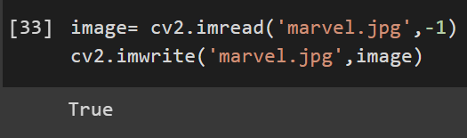
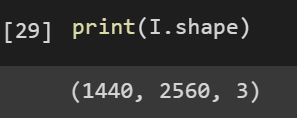

# READ AND WRITE AN IMAGE
## AIM
To write a python program using OpenCV to do the following image manipulations.
i) Read, display, and write an image.
ii) Access the rows and columns in an image.
iii) Cut and paste a small portion of the image.

## Software Required:
Anaconda - Python 3.7
## Algorithm:
### Step1:
Choose an image and save it as a filename.jpg
### Step2:
Use imread(filename, flags) to read the file.
### Step3:
Use imshow(window_name, image) to display the image.
### Step4:
Use imwrite(filename, image) to write the image.
### Step5:
End the program and close the output image windows.
## Program:
### Developed By: Kersoan P
### Register Number: 212221230050
i) #To Read,display the image
```
I = cv2.imread('marvel.jpg',1)
cv2_imshow(I)

```
ii) #To write the image
```

image= cv2.imread('marvel.jpg',-1)
cv2.imwrite('marvel.jpg',image)

```
iii) #Find the shape of the Image
```python3

print(I.shape)

```
iv) #To access rows and columns

```python3
import cv2
import random
img= cv2.imread('marvel.jpg',-1)
for i in range(150):
    for j in range(img.shape[1]):
        img[i][j] = [random.randint(0,255),random.randint(0,255),random.randint(0,255)]
cv2_imshow(img)
cv2.waitKey(0)


```
v) #To cut and paste portion of image
```python3

import cv2
img= cv2.imread('marvel.jpg',-1)
new = img[200:450,200:450]
img[150:400,150:400] = new
cv2_imshow(img)
cv2.waitKey(0)

```

## Output:

### i) Read and display the image

<br>


<br>

### ii)Write the image

<br>


<br>

### iii)Shape of the Image

<br>


<br>

### iv)Access rows and columns
<br>


<br>

### v)Cut and paste portion of image
<br>


<br>

## Result:
Thus the images are read, displayed, and written successfully using the python program.


